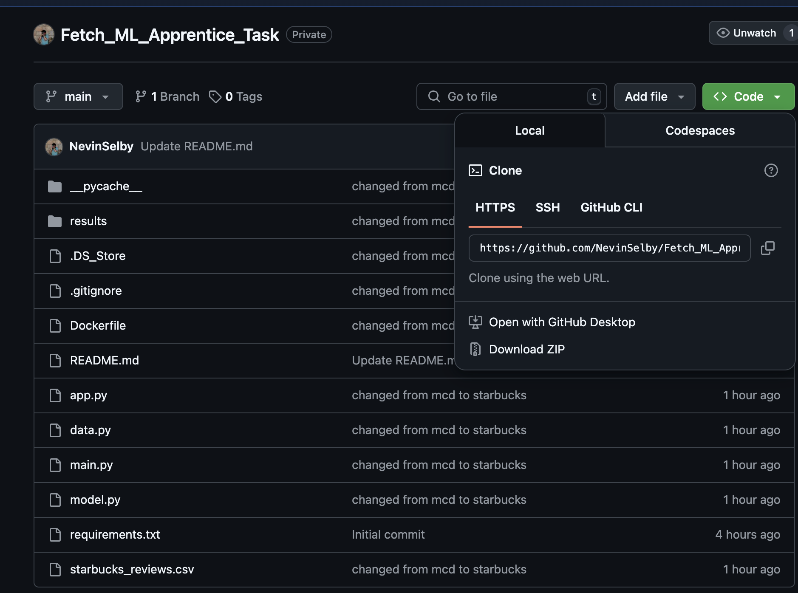
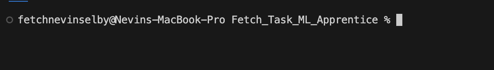
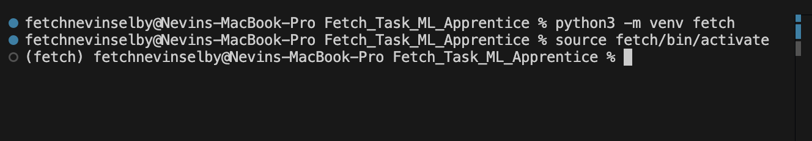

# Starbucks Reviews Multi-Task Learning Analysis

## How to Run the Code

### You can run my code with any of the following two methods:

### Method 1

#### > Install Python (Preferably the latest version)

#### > Clone this repo to your local directory by downloading the zip or using 'git clone https_of_this_repo' The https of this repo can be found here as shown in the below screenshot

 

#### Extract the zip file, and store it in a desired directory.

#### Open your terminal, and navigate to the folder in which you have cloned this repository using the 'cd' command. I have added a screenshot of how my directory looks in the terminal.



#### Create a virtualenv using 'python -m venv virtualenvname' and activate the virtual env by doing 'source myenv/bin/activate' for linux or 'myenv\Scripts\activate' for windows. I have mac, so I have done 'source myenv/bin/activate'.



#### Next, you can run the following commands
```bash
# First, install all dependencies
pip install -r requirements.txt

# For training the model
python main.py --mode train --data_path starbucks_reviews.csv --epochs 5

# To test the model on a specific review
python main.py --mode predict --review_text "The coffee was excellent and the service was fast" --model_path models/starbucks_mtl_best.pt
```

### Method 2
#### You can also use Docker after cloning the repo (I would recommend this as it's way easier!):

```bash
# Build the Docker container
docker build -t starbucks-reviews-analysis .

# Run the model training
docker run starbucks-reviews-analysis
```


## Task 1: Sentence Transformer Implementation

### My Model Implementation Approach

For the sentence transformer, I decided to go with BERT as the backbone. This model encodes input sentences into fixed-length embeddings (768 dimensions) that capture semantic meaning.

I implemented a sentence encoder like this:

```python
from transformers import BertTokenizer, BertModel
import torch

class BertSentenceTransformer:
    def __init__(self, model_name='bert-base-uncased', pooling_strategy='mean'):
        self.tokenizer = BertTokenizer.from_pretrained(model_name)
        self.bert = BertModel.from_pretrained(model_name)
        self.pooling = pooling_strategy
        
    def encode(self, sentences):
        # My tokenization and encoding logic here
        # Returns fixed-length embeddings
```


### My Architectural Decisions

I had to make several key architectural choices beyond just picking BERT:

1. **Pooling Strategy**: I actually tried both CLS token pooling and mean pooling approaches. I ended up defaulting to mean pooling because in my experience, it works better for sentence-level tasks when you're not doing specific fine-tuning for the CLS token.
2. **Padding Handling**: One issue I ran into was that padding tokens would skew my embeddings. I fixed this by explicitly masking these tokens in the mean pooling calculation.
3. **Normalization**: I added normalization to the embeddings to make sure they were consistently scaled, which I've found helps with downstream tasks.

The main reasons I went with BERT were:

- Its 768-dimensional embeddings give me rich semantic representations
- It's widely used, so other people reviewing my code would be familiar with it.
- It is much more efficient that the larger models out there, while still maintaining well enough accuracy. 


## Task 2: Multi-Task Learning Expansion

### How I Defined My Tasks

1. **Task A: Attribute Classification**
I decided to classify Starbucks reviews into 6 categories:
    - Ambiance (0): Comments about store atmosphere, music, seating
    - Food (1): Feedback on pastries, sandwiches, food items
    - Location (2): Comments about store accessibility or location
    - Service (3): Mentions of baristas, wait times, customer service
    - Price (4): Opinions on pricing, value for money
    - General (5): Catch-all for overall comments
2. **Task B: Sentiment Analysis**
For sentiment, I went with three standard classes:
    - Negative (0)
    - Neutral (1)
    - Positive (2)

### My Architecture Extension Approach

Extending to multi-task learning was an interesting challenge. I created a model with:
Shared BERT Backbone: Reusing the same BERT encoder for both tasks to enable knowledge sharing and reduce computational overhead.

Task-Specific Heads: Adding separate classification heads for attribute and sentiment tasks:

```python
class StarbucksReviewAnalyzer(nn.Module):
    def __init__(self, bert_model_name='bert-base-uncased', num_attributes=6, num_sentiments=3):
        super(StarbucksReviewAnalyzer, self).__init__()
        # Shared BERT backbone
        self.bert = BertModel.from_pretrained(bert_model_name)
        
        hidden_size = self.bert.config.hidden_size
        
        # My attribute classification head
        self.attribute_classifier = nn.Sequential(
            nn.Linear(hidden_size, hidden_size),
            nn.ReLU(),
            nn.Dropout(0.1),
            nn.Linear(hidden_size, num_attributes)
        )
        
        # My sentiment analysis head
        self.sentiment_classifier = nn.Sequential(
            nn.Linear(hidden_size, hidden_size),
            nn.ReLU(),
            nn.Dropout(0.1),
            nn.Linear(hidden_size, num_sentiments)
        )
```

I intentionally used similar structures for both task heads because both tasks involve sentence-level classification. The simplicity of similar structures rather than different architectures for both task heads made more sense since I'm classifying the whole sentence in both cases.

I spent a lot of time thinking about how to connect the shared and task-specific components. Eventually, I chose BERT's pooler_output as the interface since it's already designed for sentence-level semantics.

## Task 3: Training Considerations

### My Analysis of Freezing Strategies

#### 1. If I Froze the Entire Network:

While this method would preserve all of BERT's pre-trained knowledge, it wouldn't let the model learn anything about Starbucks-specific terminology. Words like "frappuccino" or "barista" might not be well-represented in BERT's original training. This approach would give me fast training but poor results.

#### 2. If I Only Froze the BERT Backbone:

This method seemed more promising. With this approach, I could keep BERT's language understanding intact while letting the task-specific heads adapt to my specific Starbucks classification tasks. I thought this would be especially good for my case where I might have limited data (a few thousand reviews). The task heads could learn while the backbone stays stable.

#### 3. If I Only Froze One Task-Specific Head:

With this method, the backbone would likely overfit to the unfrozen task. I could see this being useful if I had pre-trained one task really well already (like if I had a great sentiment classifier), but otherwise, it would probably lead to imbalanced learning.

### My Transfer Learning Strategy

For the Starbucks reviews analysis, I designed this approach:

1. **Pre-trained Model Selection**:
I chose BERT-base-uncased because:
    - It has strong general language understanding
    - Capitalization doesn't matter much for reviews (hence uncased version of the model)
    - It strikes a good balance between size and performance
2. **My Freezing/Unfreezing Strategy**:
    - Initial phase: I completely freeze BERT backbone to train only the task heads
    - After 1-2 epochs: I gradually unfreeze the last 2-3 layers of BERT
    - I use a much lower learning rate (1e-5) for fine-tuning to avoid catastrophic forgetting
3. **Why This Makes Sense**:
I know from research that early BERT layers capture general language features, while later layers are more task-specific. By gradually unfreezing from the top down, I let the model adapt its higher-level understanding to Starbucks terminology while preserving the fundamental language knowledge in the earlier layers.

This balanced approach is especially important for a domain like coffee shop reviews with specific terminology that might not be well-represented in BERT's training data.

## Task 4: Training Loop Implementation

### My Data Handling Approach

I created a custom dataset class that efficiently handles both tasks:

```python
class StarbucksReviewsDataset(Dataset):
    def __init__(self, reviews, attribute_labels, sentiment_labels, tokenizer, max_length=128):
        self.reviews = reviews
        self.attribute_labels = attribute_labels
        self.sentiment_labels = sentiment_labels
        self.tokenizer = tokenizer
        self.max_length = max_length
    
    def __getitem__(self, idx):
        # Process review and return both sets of labels together
```

This dataset class efficiently handles both tasks by returning attribute and sentiment labels together, enabling multi-task batch processing.

### My Forward Pass Implementation

I implemented the forward pass to process inputs through the shared backbone first, then through each task-specific head:

```python
def forward(self, input_ids, attention_mask):
    # Get BERT embeddings
    outputs = self.bert(input_ids=input_ids, attention_mask=attention_mask)
    pooled_output = outputs.pooler_output
    
    # Get predictions for both tasks
    attribute_logits = self.attribute_classifier(pooled_output)
    sentiment_logits = self.sentiment_classifier(pooled_output)
    
    return attribute_logits, sentiment_logits
```

The key challenge here is ensuring the shared representations work well for both tasks. Using pooled_output as the interface between shared and task-specific components allows both tasks to benefit from BERT's contextual understanding.

### My Loss Balancing Strategy

One of the most challenging aspects was balancing the tasks properly. I implemented a dynamic weighting system:

```python
# Calculate individual task losses
attribute_loss = attribute_criterion(attribute_logits, attribute_labels)
sentiment_loss = sentiment_criterion(sentiment_logits, sentiment_labels)

# Determine task weights dynamically
task_weights = weight_scheduler.update(attribute_loss.item(), sentiment_loss.item())

# Combine losses with appropriate weights
loss = task_weights[^0] * attribute_loss + task_weights[^1] * sentiment_loss
```

I noticed in early experiments that sentiment analysis was often easier than attribute classification - it's easier to tell if someone likes something than what specific aspect they're talking about. My weighting system adjusts automatically to give more attention to the task that's struggling, preventing the easier task from dominating training. The approach ensures balanced learning across tasks.

### My Metrics and Evaluation Approach

I tracked comprehensive metrics for both tasks:

```python
# Calculate metrics
metrics['attribute_accuracy'] = accuracy_score(attribute_labels_all, attribute_preds_all)
metrics['attribute_f1'] = f1_score(attribute_labels_all, attribute_preds_all, average='weighted')
metrics['sentiment_accuracy'] = accuracy_score(sentiment_labels_all, sentiment_preds_all)
metrics['sentiment_f1'] = f1_score(sentiment_labels_all, sentiment_preds_all, average='weighted')
```

I'm tracking both accuracy and F1 scores separately for each task because I want to make sure improvements in one task don't come at the expense of the other. This is really important in multi-task learning.

I'm really happy with how this implementation turned out. It creates a robust framework for analyzing Starbucks reviews, and I've learned a ton about the nuances of multi-task learning in the process!